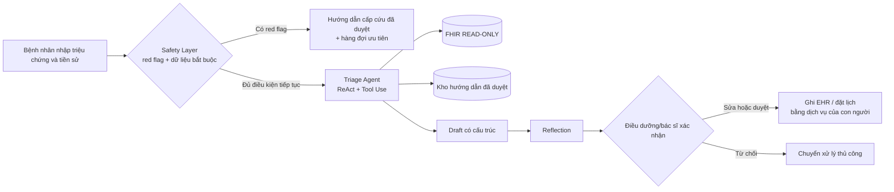

# Chủ đề 2 — Trợ lý phân loại ban đầu tại phòng khám

**Nhóm:** 08  
**Thành viên:**  
- 23127075 — Lê Trung Kiên  
- 23127205 — Lâm Hữu Khánh  
- 23127326 — Lê Mai Hoài Bảo  
- 23127185 — Mai Thị Kim Duyên  
- 23127060 — Ninh Văn Khải  

**Kịch bản:** Clinic Triage Assistant  
**Mục tiêu bài tập:** Kiến trúc một agent hỗ trợ phân loại ban đầu an toàn, có thể đánh giá được và có ranh giới trách nhiệm rõ ràng.  
**Lưu ý:** Đây là thiết kế kiến trúc phục vụ bài tập. Hệ thống không chẩn đoán, không kê đơn và không thay thế nhân viên y tế.

---

## Architecture Canvas đã điền

## 1. Hệ thống & mục tiêu

- Bệnh nhân nhập triệu chứng hiện tại, thời điểm khởi phát, mức độ, tiền sử liên quan và thông tin bổ sung theo câu hỏi của hệ thống.
- Hệ thống phát hiện dấu hiệu cảnh báo bằng một **Safety Layer tất định**, sau đó agent đọc ngữ cảnh cần thiết, hỏi làm rõ và tạo **đề xuất** về mức khẩn cấp cùng bước tiếp theo.
- “Hoàn thành” khi hệ thống tạo được một bản nháp có cấu trúc, giải thích được căn cứ, nêu rõ dữ liệu còn thiếu và chuyển bản nháp cho điều dưỡng/bác sĩ xác nhận.
- Hệ thống chỉ hỗ trợ phân loại ban đầu; quyết định lâm sàng cuối cùng luôn thuộc về nhân viên y tế.

## 2. Mẫu agent

Chọn đúng bốn mẫu định hình luồng điều khiển và ranh giới hệ thống:

1. **ReAct** — agent xen kẽ suy luận với hành động: nhận biết thông tin còn thiếu, đặt câu hỏi làm rõ, gọi công cụ và cập nhật đề xuất theo kết quả thật thay vì đoán.
2. **Tool Use** — agent đọc hồ sơ y tế qua FHIR và tra cứu kho hướng dẫn lâm sàng đã được phòng khám phê duyệt. Agent không truy cập web công cộng.
3. **Reflection** — trước khi gửi bản nháp, agent tự kiểm tra các trường bắt buộc, mâu thuẫn giữa lời kể và hồ sơ, red flag bị bỏ sót, căn cứ không hợp lệ và mức khẩn cấp không nhất quán.
4. **Human-in-the-Loop** — điều dưỡng/bác sĩ xác nhận hoặc sửa mức khẩn cấp, bước tiếp theo và mọi thao tác ghi vào hệ thống vận hành.

## 3. Công cụ & dữ liệu

### Công cụ qua lớp MCP

| Công cụ                     | Chức năng                                                  | Quyền         |
| --------------------------- | ---------------------------------------------------------- | ------------- |
| `get_patient_context`       | Đọc ngữ cảnh của đúng bệnh nhân và đúng phiên khám         | READ-ONLY     |
| `lookup_approved_guideline` | Tra cứu hướng dẫn/triage protocol đã duyệt và có phiên bản | READ-ONLY     |
| `ask_clarifying_question`   | Đưa câu hỏi làm rõ theo schema đã cho phép                 | Không ghi EHR |
| `create_triage_draft`       | Tạo bản nháp để nhân viên y tế duyệt                       | APPEND-ONLY   |
| `append_audit_event`        | Ghi metadata truy vết, không ghi raw PII vào technical log | APPEND-ONLY   |

### Dữ liệu được đọc

- Các FHIR resource tối thiểu: `Patient`, `Condition`, `AllergyIntolerance`, `MedicationStatement` và `Observation`.
- Chỉ lấy trường cần thiết cho lần phân loại hiện tại, theo consent và phạm vi phiên làm việc.
- Kho hướng dẫn lâm sàng phải là nguồn nội bộ được phê duyệt, có chủ sở hữu và phiên bản; không lấy nội dung từ web công cộng.

### Dữ liệu được ghi

- Agent chỉ ghi `DraftTriageRecommendation` và `AuditEvent` theo cơ chế append-only.
- Chỉ dịch vụ dành cho nhân viên y tế mới có quyền ghi quyết định đã xác nhận vào EHR, tạo lịch hoặc chuyển tuyến.
- Credential của agent không có quyền sửa/xóa hồ sơ, đặt lịch, phát hành đơn thuốc hoặc hoàn tất quyết định lâm sàng.

### Hợp đồng đầu ra khái niệm

```yaml
DraftTriageRecommendation:
  urgency: EMERGENCY | URGENT | ROUTINE | SELF_CARE
  nextStep: string
  rationale: string[]
  redFlags: string[]
  missingInformation: string[]
  confidenceBand: LOW | MEDIUM | HIGH
  evidenceReferences: string[]
```

Quy tắc bất biến: nếu `missingInformation` chứa dữ liệu quan trọng, `confidenceBand` là `LOW`, công cụ lỗi hoặc các nguồn mâu thuẫn, agent **không được tự hạ mức khẩn cấp**; bản nháp phải chuyển điều dưỡng xem xét.

## 4. Giới hạn tính phi tất định

### Những gì được cố định và giới hạn

- Cố định phiên bản model, system prompt, output schema, temperature và phiên bản kho hướng dẫn.
- Giới hạn số lượt hỏi làm rõ, số tool call, thời gian xử lý và chi phí mỗi phiên.
- Bắt buộc structured output; output sai schema bị từ chối và chuyển sang luồng an toàn.
- Safety Layer chạy trước LLM, dùng quy tắc đã được chuyên gia phê duyệt và không phụ thuộc vào cách agent suy luận.

### Cách đánh giá

- Dùng tập ca có nhãn của chuyên gia, bao phủ ca thường, ca khẩn cấp, dữ liệu thiếu, cách diễn đạt mơ hồ và nhóm người dùng đa dạng.
- Chạy **10 rollouts** cho mỗi ca để đo phương sai thay vì chỉ kiểm thử một lần.
- Cổng chấp nhận trước triển khai:
  - **100% schema-valid** output.
  - **100%** ca trong deterministic red-flag suite được Safety Layer chặn đúng.
  - Recall tối thiểu **98%** cho nhóm `EMERGENCY`/`URGENT` trên tập held-out có nhãn chuyên gia.
  - Ít nhất **95%** nhất quán về `urgency` giữa các rollout của cùng một ca.
  - **0** trường hợp agent tự hạ mức khi dữ liệu thiếu/độ chắc chắn thấp.
  - **0** trường hợp agent tự ghi quyết định lâm sàng hoặc thực hiện hành động ngoài quyền.
- Các ngưỡng trên là **tiêu chí chấp nhận kiến trúc cho bài tập**, không phải bằng chứng hệ thống đã an toàn, hiệu quả hoặc được phê duyệt dùng trong y tế thực tế.

### Thuộc tính chất lượng quan trọng nhất

**Safety và evaluability**: ưu tiên tránh bỏ sót ca nguy hiểm, đồng thời phải đo được agent sai ở đâu, thay đổi thế nào và ai đã xác nhận đầu ra.

## 5. Guardrails & Human-in-the-Loop

### Hành động được làm không cần giám sát

- Thu thập và kiểm tra tính đầy đủ của dữ liệu đầu vào.
- Chạy deterministic red-flag rules.
- Đọc dữ liệu đúng phạm vi qua công cụ READ-ONLY.
- Hỏi làm rõ trong danh mục câu hỏi cho phép.
- Tạo bản nháp, Reflection và ghi audit metadata dạng APPEND-ONLY.
- Hiển thị hướng dẫn liên hệ cấp cứu đã được phê duyệt khi Safety Layer bắt được red flag; đồng thời đưa ca vào hàng đợi ưu tiên.

### Hành động bắt buộc con người xác nhận

- Chốt hoặc hạ mức khẩn cấp.
- Ghi kết quả vào hồ sơ y tế chính thức.
- Đặt/hủy lịch, chuyển tuyến hoặc từ chối chăm sóc.
- Chẩn đoán, kê đơn, thay đổi thuốc hoặc đưa chỉ định điều trị cá nhân hóa.

### Giới hạn cứng

- Least privilege, consent và patient-scoped token; hết phiên phải thu hồi quyền.
- Không truy cập web công cộng; chỉ dùng nguồn đã phê duyệt và có version.
- Không ghi raw PII vào technical log; tách audit lâm sàng khỏi telemetry kỹ thuật.
- Nếu FHIR/kho hướng dẫn/LLM không khả dụng, hiển thị trạng thái không thể hoàn tất tự động và chuyển cho điều dưỡng; không đoán dữ liệu còn thiếu.
- Nội dung bệnh nhân là **dữ liệu không tin cậy**, không phải chỉ dẫn hệ thống; prompt injection không được thay đổi quyền hay chính sách.
- Có kill switch, timeout, rate limit, cost budget và cơ chế rollback phiên bản model/prompt/knowledge.

## 6. Chế độ lỗi

**Cái hỏng trước:** bệnh nhân diễn đạt mơ hồ, thiếu dữ kiện hoặc dùng ngôn ngữ/biến thể từ vựng mà hệ thống xử lý kém; agent trả lời trôi chảy nhưng bỏ sót một red flag và đề xuất mức thấp hơn thực tế.

**Ai bị ảnh hưởng:** bệnh nhân bị trì hoãn chăm sóc; nhân viên y tế nhận ca muộn; phòng khám chịu rủi ro an toàn, pháp lý và mất niềm tin.

**Cách giảm thiểu:** Safety Layer độc lập; câu hỏi làm rõ bắt buộc; không tự hạ mức khi bất định; chuyển điều dưỡng khi dữ liệu thiếu/mâu thuẫn; đo false negative và near miss; kiểm thử theo nhóm ngôn ngữ/nhân khẩu; giám sát drift và tỷ lệ override.

## 7. Phần bền vững

> **Không một đầu ra phi tất định nào được trở thành quyết định lâm sàng cuối cùng nếu chưa đi qua safety rules, quyền tối thiểu và cổng xác nhận của con người.**

Nếu ngày mai toàn bộ code agent hoặc model bị thay thế, ranh giới này vẫn phải được giữ nguyên trong credential, workflow, audit và tiêu chí nghiệm thu.

---

## Luồng kiến trúc



Safety Layer và Human Approval là hai ranh giới độc lập với model: một lớp chặn nguy hiểm trước suy luận, một lớp ngăn đề xuất trở thành hành động chính thức khi chưa có trách nhiệm con người.

## Observability và vận hành

- Ghi `modelVersion`, `promptVersion`, `schemaVersion`, `knowledgeVersion`, tool call, outcome, latency, lỗi và mã định danh phiên đã pseudonymize.
- Ghi quyết định duyệt/sửa/từ chối cùng vai trò người xác nhận trong audit lâm sàng có kiểm soát truy cập.
- Dashboard theo dõi recall trên audit set, false negative/near miss, tỷ lệ override, schema failure, tool failure, drift, latency và chi phí.
- Cảnh báo khi tỷ lệ override hoặc bất nhất vượt baseline; tạm dừng tự động hóa khi vi phạm safety threshold.
- Mọi thay đổi model/prompt/knowledge phải chạy lại evaluation suite và qua phê duyệt trước rollout.

## Đối chiếu rubric

| Tiêu chí             | Bằng chứng trong thiết kế                                               |
| -------------------- | ----------------------------------------------------------------------- |
| Pattern fit          | Bốn pattern gắn trực tiếp với hỏi làm rõ, công cụ, tự kiểm và phê duyệt |
| Integration clarity  | MCP tools, FHIR resource và quyền READ-ONLY/APPEND-ONLY được nêu rõ     |
| Non-determinism plan | Version pinning, structured output, 10 rollouts và ngưỡng chấp nhận     |
| Guardrails           | Safety Layer, least privilege và cổng con người chỉ ở hành động rủi ro  |
| Failure insight      | False negative do diễn đạt mơ hồ được truy về ranh giới đầu vào/safety  |
| Red-team performance | Các đòn tấn công và câu trả lời chuẩn bị trong file pitch riêng         |

## Nguồn tham khảo chính thức

1. World Health Organization, [Ethics and governance of artificial intelligence for health](https://www.who.int/publications/i/item/9789240037403) — quyền tự chủ của con người, an toàn, minh bạch và trách nhiệm giải trình.
2. HL7 International, [FHIR Specification](https://hl7.org/fhir/) — chuẩn trao đổi dữ liệu y tế và các resource dùng trong thiết kế.
3. National Institute of Standards and Technology, [AI Risk Management Framework](https://www.nist.gov/itl/ai-risk-management-framework) — quản trị, đo lường, quản lý và giám sát rủi ro AI liên tục.
